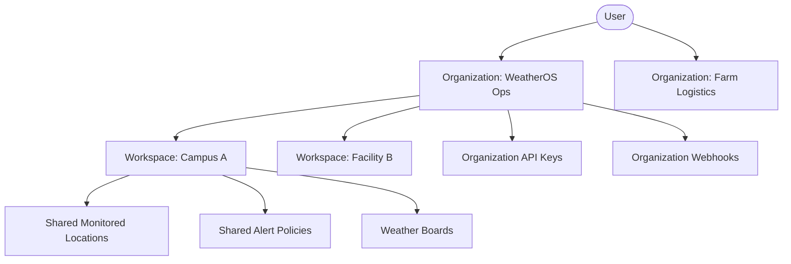

# WeatherOS Multi-Tenant Architecture

## Core Entity Hierarchy



## Database Schema (Tenant Pattern)

To achieve absolute tenant isolation, every organization-owned resource in PostgreSQL requires an `organization_id` column.

```sql
-- Organizations Table
CREATE TABLE organizations (
    id UUID PRIMARY KEY,
    slug VARCHAR(255) UNIQUE,
    name VARCHAR(255),
    status VARCHAR(50) DEFAULT 'ACTIVE'
);

-- Memberships (The Auth mapping)
CREATE TABLE organization_members (
    user_id UUID,
    organization_id UUID,
    role VARCHAR(50),
    joined_at TIMESTAMP,
    PRIMARY KEY (user_id, organization_id)
);

-- Example Resource Table (Tenant Scoped)
CREATE TABLE weather_boards (
    id UUID PRIMARY KEY,
    organization_id UUID NOT NULL REFERENCES organizations(id),
    workspace_id UUID,
    name VARCHAR(255),
    layout JSONB,
    created_by UUID
);

-- Crucial Multi-Tenant Index
CREATE INDEX idx_boards_org ON weather_boards(organization_id);
```

## The "Golden Rule" of Tenant Isolation
Every backend `SELECT`, `UPDATE`, or `DELETE` executed against a resource table **must** append `AND organization_id = req.tenantId`. We never rely on the `id` being globally unguessable (UUIDs) as a substitute for true authorization logic.
