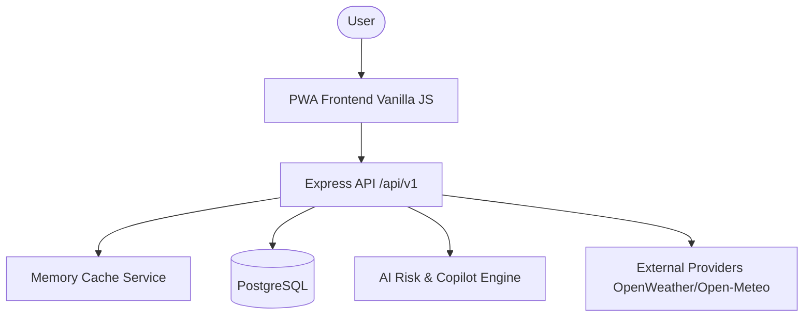

# WeatherOS Architecture

## High-Level System Architecture

## Layers
1. **Frontend (PWA)**: Completely static, vanilla JavaScript application heavily leaning on ES Modules and Web Components.
2. **API (Express.js)**: Central orchestrator validating inputs, enforcing standard responses, and catching unhandled errors securely.
3. **Service Layer**: Pure functions wrapping business logic (`riskEngine.js`, `weatherWindowService.js`).
4. **Data Layer**: Direct PostgreSQL wrapper (`neon/serverless`) strictly parametrized to prevent SQL injection.
5. **Provider Layer**: `fetch`-based wrappers with timeouts and retry mechanisms to communicate with external weather APIs.
